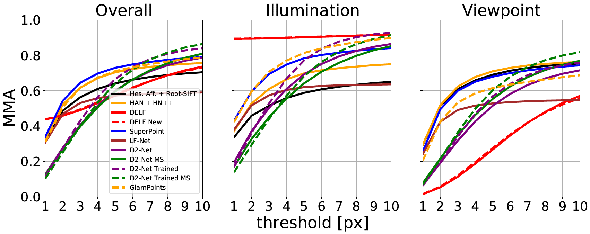

# Unofficial PyTorch implementation of GLAMpoints: Greedily Learned Accurate Match points

Unofficial PyTorch implementation of [GLAMpoints: Greedily Learned Accurate Match points](https://arxiv.org/pdf/1908.06812.pdf).
The majority of code is based on the repository [https://gitlab.com/retinai_sandro/glampoints](https://gitlab.com/retinai_sandro/glampoints)

## Requirements

Please, use Python 3, install PyTorch 1.4,  OpenCV and additional libraries from requirements.txt

## Datasets and Training

In order to re-train network please use [PS-Dataset](https://github.com/rmitra/PS-Dataset), 
train/test split is already prepared in datasets/ps_dataset/

Training configurations and paths to datasets are stored in configs/glampoints_training.yml.

```
python train.py --path_ymlfile configs/glampoints_training.yml
```

Logs and checkpoints are stored in tensorboard format in the directory logs/experiment_name/


## Validation on [HPatches-sequences](http://icvl.ee.ic.ac.uk/vbalnt/hpatches/hpatches-sequences-release.tar.gz)

Validation code is adapted from [D2-Net evaluation on HPatches](https://github.com/mihaidusmanu/d2-net/tree/master/hpatches_sequences)

To run validation on ported version of weights please use 

```
python evaluate_hpatches.py --path_hpatches - path_to_hpatches_sequences --init_weights init ---path_ymlfile glampoints_eval_ported_weights.yml --name glampoints_retina
``` 

To run validation on trained on PS-dataset version please use 
 
```
python evaluate_hpatches.py --path_hpatches - path_to_hpatches_sequences --init_weights modified ---path_ymlfile glampoints_eval.yml --name glampoints_retina**
```

To create plots, please downlod results of other methods from [D2Net repo](https://github.com/mihaidusmanu/d2-net/blob/master/hpatches_sequences/download_cache.sh) and use 
Add in methods,
```
python eval/generate_hpatches_plot.py --path_to_hpatches_sequences --path_to_cache_dir
```
 
Ported weights from Tensorflow implementation



Trained network on PS-Dataset

